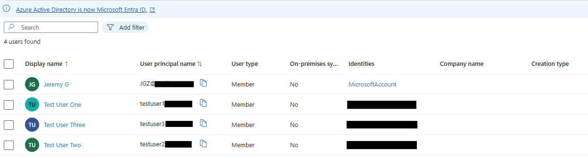
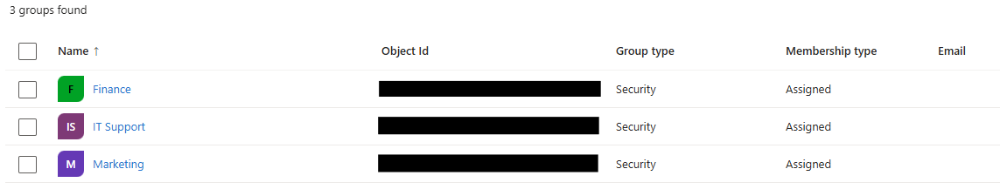

# IT Helpdesk Scenarios

This repository demonstrates practical IT helpdesk workflows by simulating real-world support scenarios.  
Using **Microsoft Entra ID (Azure Active Directory)** for account management and **Jira Service Management** for ticket documentation, the project covers common Tier 1 IT tasks such as password resets, account lockouts, and group management.  

Each scenario includes both the **technical fix** and the **corresponding helpdesk ticket lifecycle**, showcasing end-to-end IT support practices.  

In addition to serving as a personal portfolio project, this repository is also intended to support **aspiring IT technicians** by providing clear examples of common workflows and scenarios they will likely encounter in real environments. The goal is to help others gain confidence in handling these foundational IT tasks as they begin their careers.  

---

## 📋 Table of Scenarios

| Scenario | Tools Used | Skills Practiced |
|----------|------------|------------------|
| Password Reset | Azure AD, Jira | Account management, ticketing |
| Account Lock/Unlock | Azure AD, Jira | Security, user access control |
| Group Management | Azure AD, Jira | Role-based access, group membership |

---

## 🛠 Tools & Technologies
- **Microsoft Entra ID (Azure Active Directory)** – Cloud-based identity and access management  
- **Jira Service Management** – Ticketing workflow simulation  
- **GitHub** – Documentation and portfolio showcase  

---

## 📇 Directory Setup

Before running the scenarios, a small test directory was created in **Microsoft Entra ID (Azure AD)** to simulate a real organization.  
This included **test users** and **security groups** for managing access.

### 👤 Test Users
- Test User One (`testuser1@<tenant>.onmicrosoft.com`)  
- Test User Two (`testuser2@<tenant>.onmicrosoft.com`)  
- Test User Three (`testuser3@<tenant>.onmicrosoft.com`)  

  

### 👥 Groups
- Marketing Team  
- Finance Team  
- IT Support  

  

---

## ✅ Scenario 1: Password Reset

### Issue
User **Test User One** reported being unable to log in to Microsoft 365 services.  

### Action Taken
- Accessed Microsoft Entra ID (Azure AD) Admin Center.  
- Reset user password and generated temporary credentials.  
- Verified sign-in flow, user prompted to set new password at first login.  

### Resolution
User successfully regained access.  

### Documentation
- Ticket created in Jira (`ITHD-1`).  
- Progress tracked from *To Do → In Progress → Done*.  
- Internal notes documented password reset workflow.

➡️ [View full scenario →](./password-reset.md)

---

## 🔒 Scenario 2: Account Lock/Unlock

### Issue
User **Test User Two** was temporarily locked out of their account.  

### Action Taken
- Blocked sign-in for the account in Entra ID.  
- Verified login failure with lockout message.  
- Re-enabled sign-in to restore access.  

### Resolution
Account lock/unlock process completed successfully.  

### Documentation
- Ticket created in Jira (`ITHD-2`).  
- Progress tracked from *To Do → In Progress → Done*.  
- Internal notes documented the lock/unlock workflow.  


➡️ [View full scenario →](./account-lock.md)

---

## 👥 Scenario 3: Group Management

### Issue
User **Test User Three** required updated group membership.  

### Action Taken
- Verified no existing group memberships.  
- Added Test User Three to **IT Support** group.  
- Confirmed membership assignment in Entra ID.  

### Resolution
Group membership updated successfully.  

### Documentation
- Ticket created in Jira (`ITHD-3`).  
- Progress tracked from *To Do → In Progress → Done*.  
- Internal notes documented group membership update workflow.  

➡️ [View full scenario →](./group-management.md)

---

## 📂 Repository Structure
```plaintext
├── password-reset/
│   └── README.md
│
├── account-lock/
│   └── README.md
│
├── group-management/
│   └── README.md
│
├── images/
│   ├── password-reset/
│   ├── account-lock/
│   ├── group-management/
│   └── directory/
│
└── README.md
