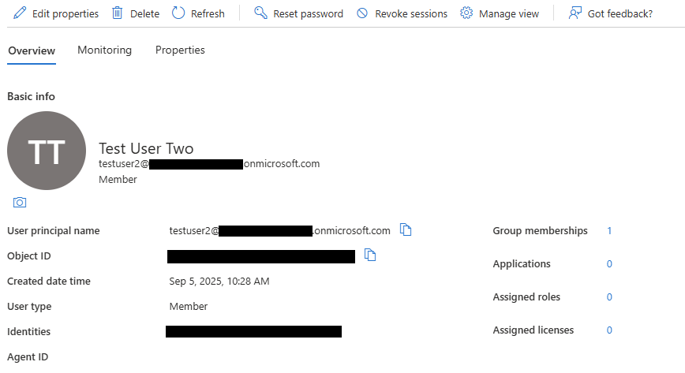
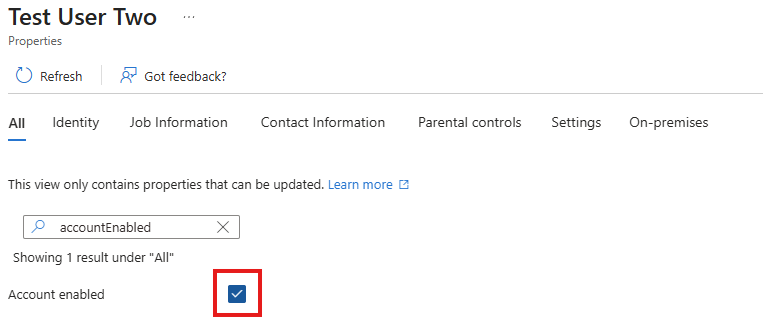
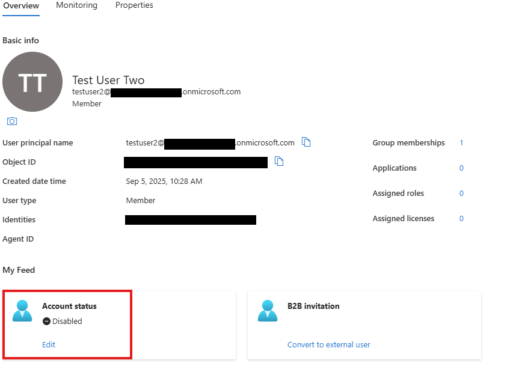
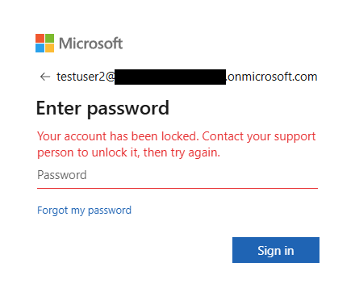

# Scenario: Account Lock/Unlock

## 📝 Issue
User **Test User Two** reported being unable to log in due to account lockout.  

## 🔧 Action Taken
- Accessed Microsoft Entra ID (Azure AD) Admin Center.  
- Blocked sign-in by disabling account status.  
- Verified the user-facing error message: *“Your account has been locked. Contact your support person to unlock it.”*  
- Re-enabled sign-in by setting account status back to Enabled.  

## ✅ Resolution
User account successfully unlocked and access restored.  

---

## 📂 Documentation

### Azure AD (Microsoft Entra ID)
-   
-   

### User View
-   
-  
### Jira Service Management
-   
-   
-   

---

## 🗂 Ticket Log
**Ticket ID:** ITHD-2  
**Summary:** Account unlock for Test User Two  
**Priority:** Medium  
**Status:** Closed ✅  

**Notes:**  
- User unable to log in due to account lock.  
- Account sign-in re-enabled after verification.  
- User confirmed restored access to Microsoft 365 services.  

---

## 🎯 Skills Demonstrated
- Identity & Access Management (Azure AD)  
- User account troubleshooting (lock/unlock scenarios)  
- Ticket creation and lifecycle management (Jira)  
- End-to-end IT documentation practices  

---
