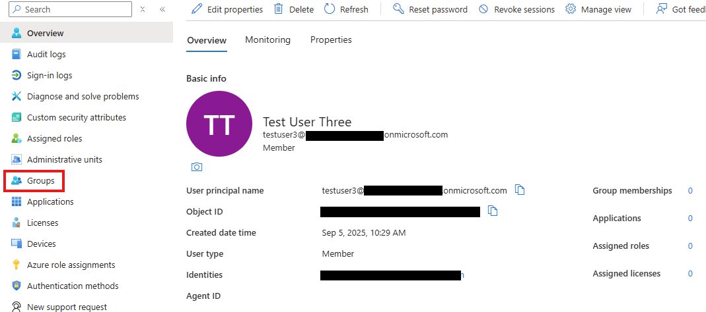
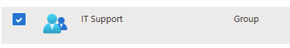
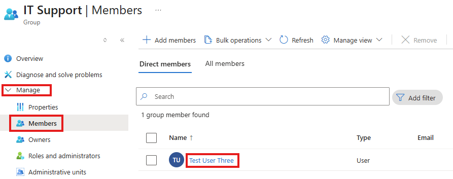
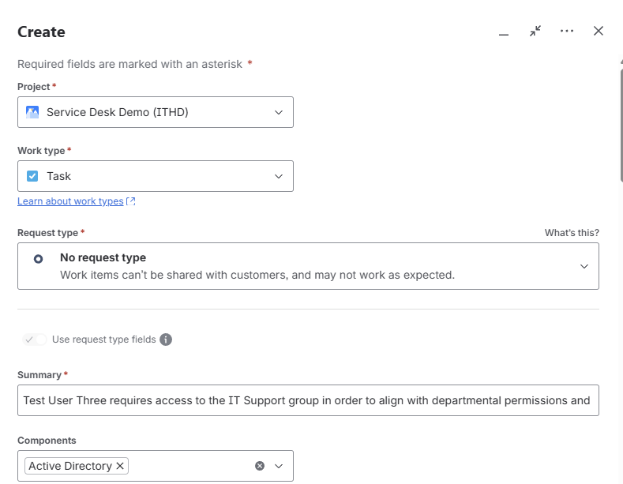
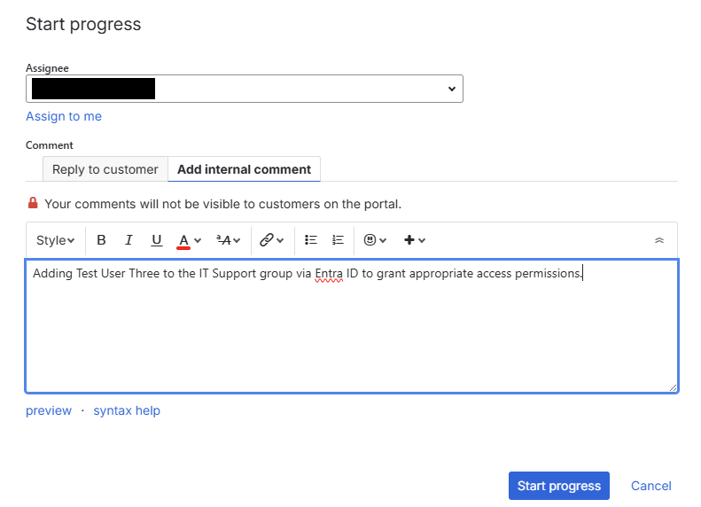
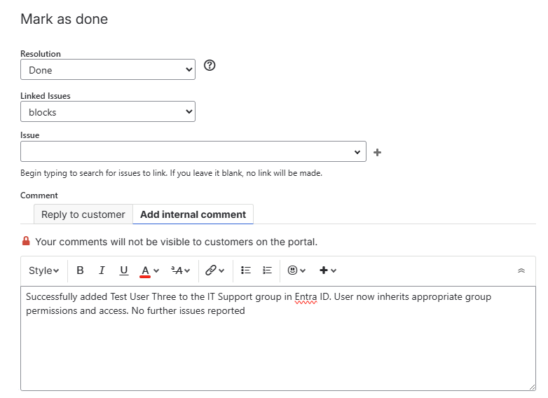

# Scenario: Group Management

## 📝 Issue
Test User Three required assignment to an existing group in Microsoft Entra ID (Azure AD). 

## 🔧 Action Taken
- Reviewed directory groups (Finance, IT Support, Marketing).  
- Verified Test User Three had no existing group memberships.  
- Added Test User Three to the **IT Support** group.  
- Confirmed group membership assignment in Entra ID.

## ✅ Resolution
Test User Three was successfully added to the IT Support group, and membership was confirmed. 

---

## 📂 Documentation

### Azure AD (Microsoft Entra ID)
-   
- 
- 
- 

### Jira Service Management
-   
-   
-   

---

## 🗂 Ticket Log
**Ticket ID:** ITHD-3  
**Summary:** Add Test User Three to IT Support group  
**Priority:** Medium  
**Status:** Closed ✅    

**Notes:**  
- Verified no existing group memberships for the user.  
- Added Test User Three to IT Support group.  
- Confirmed successful membership assignment.  
- Ticket closed after validation. 

---

## 🎯 Skills Demonstrated
- Azure Active Directory group membership management  
- Verification of directory users and permissions  
- Ticket creation and lifecycle management (Jira)  
- IT documentation practices  
