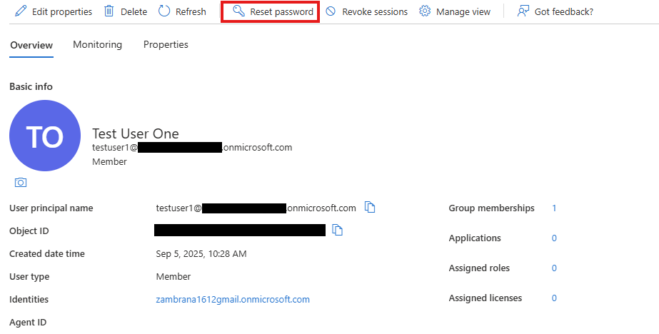
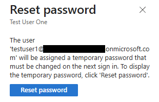
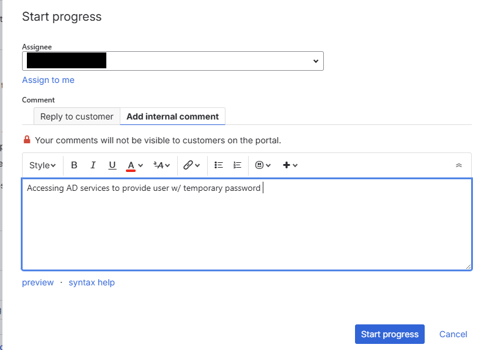

# Scenario: Password Reset

## 📝 Issue
User **Test User One** reported being unable to log in to Microsoft 365 services.  

## 🔧 Action Taken
- Accessed Microsoft Entra ID (Azure AD) Admin Center.  
- Reset user password and generated temporary credentials.  
- Verified sign-in flow, user prompted to set new password at first login.  

## ✅ Resolution
Password successfully reset. User was able to log in and update credentials.  

---

## 📂 Documentation

### Azure AD (Microsoft Entra ID)
-   
-   -> 

### Jira Service Management
-   
-   
-   

---

## 🗂 Ticket Log
**Ticket ID:** ITHD-1  
**Summary:** Password reset for Test User One  
**Priority:** Medium  
**Status:** Closed ✅  

**Notes:**  
- User unable to log in due to forgotten/mistyped password.  
- Temporary password issued, user required to change at next login.  

---

## 🎯 Skills Demonstrated
- Identity & Access Management (Azure AD)  
- User account troubleshooting  
- Ticket creation and lifecycle management (Jira)  
- Clear IT documentation practices  

---
